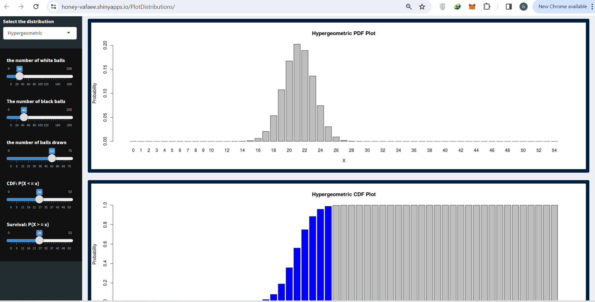

# Shiny-apps-for-distributions
<!-- Improved compatibility of back to top link: See: https://github.com/othneildrew/Best-README-Template/pull/73 -->
<a name="readme-top"></a>


<!-- PROJECT LOGO -->
<br />
<div align="center">

<h3 align="center">Shiny apps for distributions </h3>

  <p align="center">
    Department of Bioinformatics, IBB, University of Tehran
    <br />
  </p>
</div>


<div align="center">
  <a href="https://honey-vafaee.shinyapps.io/PlotDistributions/"></a>
</div>

<!-- TABLE OF CONTENTS -->
<details>
  <summary>Table of Contents</summary>
  <ol>
    <li>
      <a href="#Usage">Shiny apps for distributions Link</a>
    </li>
    <li><a href="#Shiny">Shiny apps for distributions Implementations in R</a></li>
    <li><a href="#Overview">Overview</a></li>
    <li><a href="#Features">Features</a></li>
    <li><a href="#Distributions">Distributions Included</a></li>
    <li><a href="#Code_Explanation">Code Explanation</a></li>
    <li><a href="#Languages_Used">Languages Used</a></li>
    <li><a href="#Contact">Contact</a></li>
  </ol>
</details>

<h2 id="Usage >Usage</h2>

Visit the live app at: [ShinyDistributionsApp](https://honey-vafaee.shinyapps.io/PlotDistributions/)


<!-- ABOUT THE PROJECT -->
<h1 id="Shiny"> Shiny apps for distributions Implementations in R</h1>

<h2 id="Overview"> Overview</h2>
This Shiny app illustrates the Probability Density Function (PDF), Cumulative Distribution Function (CDF), and survival functions of various distributions: Bernoulli, Binomial, Hypergeometric, Geometric, and Negative Binomial.

<h2 id="Features"> Features </h2>

- Select a distribution from the dropdown menu.
- Modify the parameters of the chosen distribution.
- Change the input value to see the updated plots.
- Shade the relevant areas under the curve for the CDF and survival plots.

<h2 id="Distributions"> Distributions Included</h2>

- Bernoulli
- Binomial
- Hypergeometric
- Geometric
- Negative Binomial


<h2 id="Distributions"> Distributions Implemented</h2>
The following methods are implemented in the Shiny app for each distribution:

### Bernoulli Distribution
- Probability Mass Function (PMF)
- Cumulative Distribution Function (CDF)
- Survival Function (1 - CDF)

### Binomial Distribution
- Probability Mass Function (PMF)
- Cumulative Distribution Function (CDF)
- Survival Function (1 - CDF)

### Hypergeometric Distribution
- Probability Mass Function (PMF)
- Cumulative Distribution Function (CDF)
- Survival Function (1 - CDF)

### Geometric Distribution
- Probability Mass Function (PMF)
- Cumulative Distribution Function (CDF)
- Survival Function (1 - CDF)

### Negative Binomial Distribution
- Probability Mass Function (PMF)
- Cumulative Distribution Function (CDF)
- Survival Function (1 - CDF)

  
  <h2 id ="Code_Explanation"> Code Explanation</h2>
The Shiny app code is structured into the following components:

### `ui.R`
This file defines the user interface of the Shiny app. It includes:
- **Dropdown Menu:** Allows users to select the distribution they want to visualize.
- **Parameter Inputs:** Provides sliders or input fields to adjust the parameters of the chosen distribution.
- **Plot Outputs:** Displays the PDF, CDF, and survival function plots.

### `server.R`
This file contains the server logic of the Shiny app. It includes:
- **Reactive Expressions:** React to user inputs and update the plots accordingly.
- **Plotting Functions:** Generate the plots for the PDF, CDF, and survival functions using `ggplot2`.
- **Shading Areas:** Highlight the relevant areas under the curve for the CDF and survival function plots.

### `app.R`
This is the main file that combines `ui.R` and `server.R` to create the Shiny app. It includes:
- **UI Definition:** Calls the `ui` function to define the user interface.
- **Server Definition:** Calls the `server` function to define the server logic.
- **Shiny App:** Uses the `shinyApp` function to create and run the Shiny app.

### `Distributions` Folder
This folder contains R scripts that define functions for calculating the PDF, CDF, and survival functions for each distribution. Each script includes:
- **Probability Mass Function (PMF):** Function to calculate the probability of each outcome.
- **Cumulative Distribution Function (CDF):** Function to calculate the cumulative probability up to each outcome.
- **Survival Function:** Function to calculate the survival probability (1 - CDF) for each outcome.


## Running Locally

To run the app locally, follow these steps:

1. Ensure you have R and RStudio installed.
2. Install the required packages:
   ```r
   install.packages(c("shiny", "ggplot2"))```


<h2 id = 'Contributing'>Contributing</h2>
<p>
Contributions to this project are welcome. You can contribute by improving the code efficiency, adding new features, or fixing bugs. Please initiate a pull request or open an issue if you have suggestions or feedback.
</p>
<h2 id="Languages_Used"> Languages Used</h2>
R Packages 
<p align="right">(<a href="#readme-top">back to top</a>)</p>

<!-- CONTACT -->
<h3 id="Contact"> Contact</h3>

vafaeeshaarbaf@gmail.com


<p align="right">(<a href="#readme-top">back to top</a>)</p>


<!-- ACKNOWLEDGMENTS -->
## Acknowledgments

Department of Bioinformatics, IBB, University of Tehran

<p align="right">(<a href="#readme-top">back to top</a>)</p>


<!-- MARKDOWN LINKS & IMAGES -->
<!-- https://www.markdownguide.org/basic-syntax/#reference-style-links -->
[contributors-shield]: https://img.shields.io/github/contributors/github_username/repo_name.svg?style=for-the-badge
[contributors-url]: https://github.com/github_username/repo_name/graphs/contributors
[forks-shield]: https://img.shields.io/github/forks/github_username/repo_name.svg?style=for-the-badge
[forks-url]: https://github.com/github_username/repo_name/network/members
[stars-shield]: https://img.shields.io/github/stars/github_username/repo_name.svg?style=for-the-badge
[stars-url]: https://github.com/github_username/repo_name/stargazers
[issues-shield]: https://img.shields.io/github/issues/github_username/repo_name.svg?style=for-the-badge
[issues-url]: https://github.com/github_username/repo_name/issues
[license-shield]: https://img.shields.io/github/license/github_username/repo_name.svg?style=for-the-badge
[license-url]: https://github.com/github_username/repo_name/blob/master/LICENSE.txt
[linkedin-shield]: https://img.shields.io/badge/-LinkedIn-black.svg?style=for-the-badge&logo=linkedin&colorB=555
[linkedin-url]: https://linkedin.com/in/linkedin_username
[product-screenshot]: images/screenshot.png
[Next.js]: https://img.shields.io/badge/next.js-000000?style=for-the-badge&logo=nextdotjs&logoColor=white
[Next-url]: https://nextjs.org/
[React.js]: https://img.shields.io/badge/React-20232A?style=for-the-badge&logo=react&logoColor=61DAFB
[React-url]: https://reactjs.org/
[Vue.js]: https://img.shields.io/badge/Vue.js-35495E?style=for-the-badge&logo=vuedotjs&logoColor=4FC08D
[Vue-url]: https://vuejs.org/
[Angular.io]: https://img.shields.io/badge/Angular-DD0031?style=for-the-badge&logo=angular&logoColor=white
[Angular-url]: https://angular.io/
[Svelte.dev]: https://img.shields.io/badge/Svelte-4A4A55?style=for-the-badge&logo=svelte&logoColor=FF3E00
[Svelte-url]: https://svelte.dev/
[Laravel.com]: https://img.shields.io/badge/Laravel-FF2D20?style=for-the-badge&logo=laravel&logoColor=white
[Laravel-url]: https://laravel.com
[Bootstrap.com]: https://img.shields.io/badge/Bootstrap-563D7C?style=for-the-badge&logo=bootstrap&logoColor=white
[Bootstrap-url]: https://getbootstrap.com
[JQuery.com]: https://img.shields.io/badge/jQuery-0769AD?style=for-the-badge&logo=jquery&logoColor=white
[JQuery-url]: https://jquery.com
